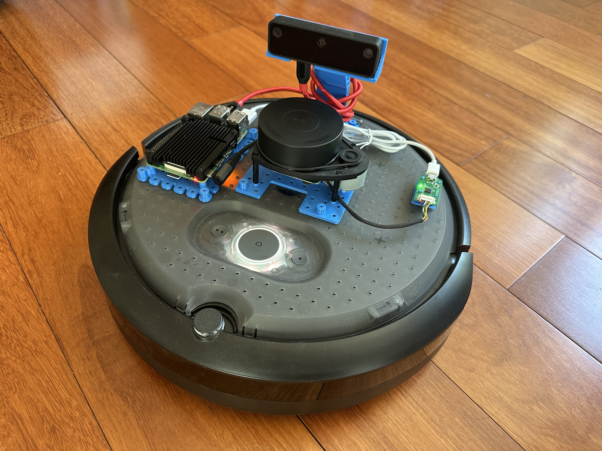

# Argus - Autonomous Home Patrol Robot

An intelligent home security and patrol robot built with ROS2 Humble, featuring autonomous navigation, SLAM mapping, computer vision, and anomaly detection capabilities.



## 🤖 Overview

Argus is a sophisticated home patrol robot designed to autonomously monitor and secure residential spaces. Built on the robust iRobot Create3 platform and enhanced with advanced sensors, it provides comprehensive surveillance capabilities while learning and mapping your home environment.

### Demo Video
[Robot in Action](assets/IMG_0462.mov)

## 🎯 Key Features

### 🗺️ **Autonomous Navigation & SLAM**
- **Real-time mapping** using SLAM (Simultaneous Localization and Mapping) with slam_toolbox
- **Autonomous navigation** with Nav2 stack for intelligent path planning
- **Map persistence** with automatic saving of explored areas as timestamped PNG images
- **Dynamic obstacle avoidance** using RPLidar A1 sensor data

### 👁️ **Advanced Computer Vision**
- **OAK-D-LITE depth camera** for RGB-D imaging with 1080p resolution at 30fps
- **Depth perception** with stereo vision and subpixel accuracy
- **Interactive image capture** for on-demand photography
- **Real-time video streaming** with configurable quality settings
- **OpenAI API integration** for intelligent visual anomaly detection

### 🌐 **Web Dashboard Control** 
- **Real-time browser control** accessible from any device on the network
- **Dual input support**: Desktop keyboard controls + mobile virtual joystick
- **Live camera preview** with thumbnail auto-refresh and click-to-enlarge modal
- **Progressive Web App (PWA)** - install on mobile home screen for app-like experience
- **Network accessible** at http://192.168.1.201:8000 for remote operation
- **Sub-10ms latency** via WebSocket for responsive real-time control

### 🎮 **Traditional Control Options**
- **Xbox controller support** with customizable button mappings
- **Automatic docking/undocking** via controller buttons (X/Y)
- **Keyboard teleoperation** as backup control method
- **Adjustable movement parameters** (speed, turbo mode, angular velocity)

### 🏠 **Home Security Features**
- **Continuous patrol modes** with learned route optimization
- **Anomaly detection** using AI-powered image analysis
- **Location memory** for tracking object positions and changes
- **Alert system** for detected anomalies or unusual activities

### 🔧 **Technical Capabilities**
- **ROS2 Humble** architecture for modular, extensible design
- **Multi-sensor fusion** (LiDAR, RGB-D camera, IMU, wheel odometry)
- **Distributed processing** with FastDDS middleware
- **Real-time performance** optimized for responsive operation

## 🛠️ Hardware Configuration

- **Base Platform**: iRobot Create3 (IP: 192.168.1.68)
- **Compute Unit**: Raspberry Pi 4 running Ubuntu 22.04
- **Depth Camera**: OAK-D-LITE with stereo vision
- **LiDAR**: RPLidar A1 for 360° range sensing
- **Network**: WiFi connectivity with FastDDS server (192.168.1.201)

## 🚀 Quick Start

### Prerequisites
- ROS2 Humble installed on Ubuntu 22.04
- Python 3.8+ with OpenCV and NumPy
- Modern web browser (2019+ for ES6 support) for dashboard control
- Network connectivity for remote web access
- Xbox controller (optional, for traditional manual control)

### Installation
1. Clone the repository:
```bash
git clone https://github.com/yourusername/argus.git
cd argus
```

2. Build the ROS2 workspace:
```bash
cd create3_ws
colcon build --packages-select drive
source install/setup.bash
```

### Basic Operation

#### Web Dashboard Control (Recommended)
```bash
# Terminal 1 - Start robot controller (REQUIRED FIRST)
source /opt/ros/humble/setup.bash 
cd ~/argus/create3_ws
source install/setup.bash
ros2 launch drive controller.launch.py

# Terminal 2 - Start web dashboard (RECOMMENDED)
cd ~/argus/dashboard
./test_dashboard.sh

# Access dashboard at: http://192.168.1.201:8000
# Mobile: Add to home screen for app-like experience
```

#### Traditional Manual Control
```bash
# Terminal 1 - Start robot control
source /opt/ros/humble/setup.bash 
cd ~/argus/create3_ws
source install/setup.bash
ros2 launch drive controller.launch.py

# Terminal 2 - Keyboard control (alternative)
ros2 run teleop_twist_keyboard teleop_twist_keyboard
```

#### SLAM Mapping
```bash
# Terminal 3 - Start SLAM
ros2 launch slam_toolbox online_sync_launch.py

# Terminal 4 - Capture maps
python3 scripts/map2img.py
```

#### Camera Operations
```bash
# Terminal 5 - Start camera
ros2 launch depthai_ros_driver camera.launch.py params_file:="/home/ubuntu/config/my_rgbd.yaml"

# Terminal 6 - Interactive capture
python3 scripts/capture_image.py
```

## 📁 Project Structure

```
argus/
├── create3_ws/                 # ROS2 workspace
│   └── src/drive/             # Custom control package
│       ├── drive/             # Python modules
│       ├── launch/            # Launch configurations
│       └── config/            # Parameter files
├── dashboard/                 # Web control interface
│   ├── backend/               # FastAPI server + ROS2 bridge
│   │   ├── main.py           # Main server (direct ROS2) - RECOMMENDED
│   │   ├── main_simple.py    # CLI bridge server - NOT RECOMMENDED
│   │   ├── ros_control.py    # Direct ROS2 control (works)
│   │   ├── cli_bridge.py     # CLI command bridge (doesn't work)
│   │   └── camera_service.py # OAK-D camera access
│   ├── frontend/              # Static web interface
│   │   ├── index.html        # Main dashboard page
│   │   ├── css/main.css      # Responsive styling
│   │   └── js/               # Control modules
│   ├── test_dashboard.sh     # Dashboard startup (RECOMMENDED)
│   └── test_simple.sh        # CLI bridge startup (NOT RECOMMENDED)
├── scripts/                   # Standalone utilities
│   ├── map2img.py            # SLAM map capture
│   └── capture_image.py      # Camera utilities
├── ColorCamera/              # OAK-D camera scripts
├── config/                   # Camera configurations
└── assets/                   # Documentation media
```

## 🎮 Control Methods

### Web Dashboard Controls
#### Desktop (Keyboard)
- **Movement**: `u,i,o,j,k,l,m,comma,period` (same as teleop.py)
- **Holonomic**: Hold `Shift` + movement keys
- **Speed**: `q/z` (all), `w/x` (linear), `e/c` (angular)  
- **Dock**: `d` (dock), `s` (undock)
- **Help**: `h` (toggle help display)

#### Mobile (Touch)
- **Virtual joystick**: Drag to move robot
- **Speed sliders**: Adjust linear/angular speeds  
- **Touch buttons**: Dock/undock controls
- **Emergency stop**: Large red button

### Xbox Controller Mapping
- **Left Stick**: Forward/backward movement
- **Right Stick**: Rotation (yaw)
- **A Button**: Enable movement (deadman switch)
- **B Button**: Turbo mode
- **X Button**: Dock robot
- **Y Button**: Undock robot

## 🔧 Configuration

### Movement Parameters
Adjust robot movement in `create3_ws/src/drive/config/twist.yaml`:
- Linear speed: 0.3 m/s (normal), 1.0 m/s (turbo)
- Angular speed: 0.8 rad/s (normal), 1.0 rad/s (turbo)

### Camera Settings
Configure OAK-D-LITE in `config/my_rgbd.yaml`:
- Resolution: 1080p at 30fps
- Manual focus: 130 (optimized for ~1m distance)
- Depth alignment and stereo processing enabled

## 🤝 Contributing

Contributions are welcome! Please read our contributing guidelines and submit pull requests for any improvements.

## 📄 License

This project is licensed under the MIT License - see the [LICENSE](LICENSE) file for details.

## 🙏 Acknowledgments

- iRobot for the Create3 platform
- Luxonis for OAK-D-LITE camera
- ROS2 and Nav2 communities
- SLAM Toolbox developers

---

**Note**: This robot is designed for indoor use only. Always ensure safe operation and comply with local regulations regarding autonomous robots.